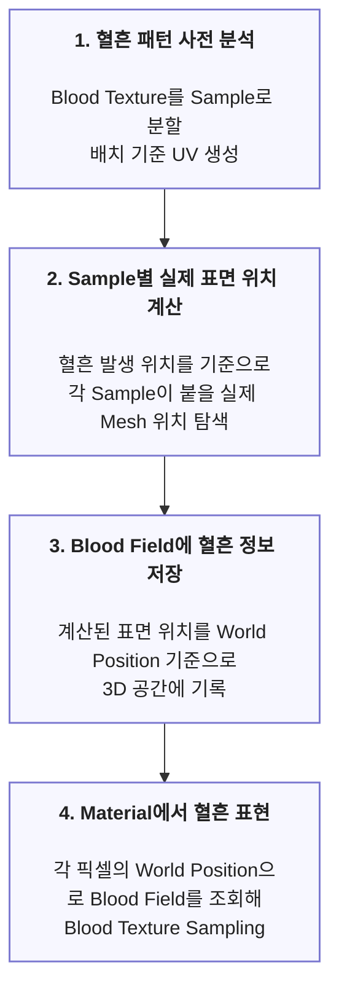

# World-Space 3D Blood Field

> World Space에 혈흔 Texture 정보를 저장하고 Material에서 조회해 모서리, 굴곡, Foliage 등 기존 Decal 방식의 한계를 보완한 혈흔 시스템

## 목차

## 설계 배경

Decal은 하나의 투영 방향을 기준으로 **영역 내에 이미지를 투영**하기 때문에 **표면 방향이 크게 달라지는 모서리, 굴곡 등**에서는 원본 형태를 유지하기 어려웠습니다. 따라서 다양한 표면에서도 일관된 혈흔 표현이 가능한 시스템을 만들려고 했습니다.

|  |  |  |
|:---:|:---:|:---:|
| **모서리에서 길게 늘어지는 현상** | **Foliage에서 거의 보이지 않는 현상** | **굴곡에서 끊기는 현상** |

## 구조 다이어그램

## 핵심 구현

## 1. Blood Pattern Sample 생성

### 방법 소개

a. Blood Texture를 고정 Grid로 나누고 각 Cell 내부에서 혈흔 Alpha가 차지하는 Coverage를 계산합니다.

b. 일정 비율 이상 혈흔이 포함된 Cell만 선택해 해당 Cell의 중심 UV를 Sample 배열로 저장합니다. 생성된 Sample은 런타임에서 실제 표면 위치를 계산하기 위한 기준점으로 사용합니다.

---

### 표면 변화 대응을 위한 Sample 단위 분할

Decal은 하나의 투영 방향을 기준으로 이미지를 투영하기 때문에, 표면 방향이 급격하게 달라지는 모서리나 굴곡에서 원래 혈흔 패턴 형태를 유지하기 어렵다고 판단했습니다.

따라서 Normal이 크게 달라지는 영역을 독립적으로 처리하기 위해 Blood Texture를 여러 Sample로 나누고, 각 Sample이 배치될 실제 표면 위치를 개별적으로 계산하도록 했습니다.

---

### Grid 기반 Sample 추출

Sample은 최종 혈흔 이미지를 복원하는 데이터가 아닌, 혈흔이 존재할 영역의 대표 위치입니다. 실제 형태와 디테일은 최종 단계에서 원본 Blood Texture를 다시 Sampling하여 표현합니다.

#### 검토한 대안 - Weighted Random Sampling

혈흔 픽셀의 분포를 정밀하게 반영하기 위해 WRS도 검토했습니다. 하지만 Sample의 목적은 대표 위치를 얻는 것이므로 후보 추출 및 거리 검증까지 추가하는 것은 현재 목적에 비해 복잡하다고 판단했습니다.

#### 최종 선택 - 고정 Grid

Sample로 분할하기 위해 Texture를 동일한 크기의 Cell로 나누고 각 Cell에서 최대 하나의 Sample만 생성하는 방법을 선택했습니다.

- Sample 수의 상한 명확함 - 5x5 Grid 기준 최대 25개
- 추가 후보 탐색 불필요 - 각 Cell 한 번씩만 검사
- 특정 영역으로 Sample이 몰리는 현상 방지 - 서로 떨어진 영역도 독립 판단

---

### Alpha Coverage 기반 유효 Cell 선택

Blood Texture는 불규칙한 형태를 가지므로 전체 영역이 혈흔으로 채워질 가능성이 낮고 Alpha가 비어 있는 영역이 많이 포함됩니다. 따라서 Grid의 모든 Cell에서 Sample을 생성하면 혈흔이 전혀 없거나 아주 적은 픽셀만 포함된 영역까지 동일하게 하나의 Sample을 차지하게 될 수 있었습니다.

각 Sample은 이후 표면 탐색과 Blood Field 기록으로 이어지기 때문에 작은 Cell까지 유지할 필요가 없다고 판단했습니다.

#### 방법

각 Cell에서 유효한 Alpha 픽셀이 차지하는 비율을 계산하고 일정 Coverage 이상인 Cell만 최종적으로 Sample로선택했습니다.

#### 실험 결과

여러 Coverage를 비교한 결과, 1%는 너무 작은 영역까지 유지되었고 5%는 너무 많은 영역이 탈락되었습니다. 따라서 3%를 기준값으로 선택했습니다.

| **1%** | **3%** | **5%** |
|:---:|:---:|:---:|
|  |  | |
|  |  | |

---

### Editor 사전 처리 및 Data Asset 저장

Texture 분석 결과는 Texture가 변경되지 않는 한 같기 때문에, Editor에서 한 번 생성하고 Runtime에서는 읽어 사용할 수 있도록 구성했습니다.

#### 방법

a. Blood Pattern용 Data Asset을 생성하고 Blood Texture를 지정합니다.

b. Editor Tool에서 Texture를 분석하고 Sample UV를 자동 생성하여 해당 Data Asset에 저장합니다.

c. 사용할 Blood Pattern Data Asset을 Project Settings의 배열에 넣어줍니다.

d. 등록된 Data Asset의 Blood Texture 정보를 가져와 Material에서 참고할 Texture2DArray를 자동 생성 및 갱신하도록 했습니다.
이를 통해 Texture ID와 Texture Array 인덱스를 수동으로 관리하며 발생할 수 있는 불일치 문제를 줄였습니다.

---

## 2. Sample별 실제 표면 위치 계산

1차 Normal Trace
2차 Trace
CornerPoint
Wrapping

## 3. 3D Blood Field 기록

World Position → Voxel
주변 Voxel 갱신
RGBA 저장 정보

## 4. Material에서 Blood Field 조회

World Position → Volume UVW
UV / Pattern ID → Blood Texture sample

## Troubleshooting
예상 위치에서 Tangent/Bitangent Trace 실패
Probe 깊이 문제
HitPoint를 최종 위치로 써서 패턴 간격 붕괴
Collision Hit ≠ 알고리즘상 유효 Hit
Chamfer 때문에 Normal Threshold 수정
해상도/Voxel Size로 UV 깨짐
## 트레이드오프 및 한계

Volume 해상도 ↔ 메모리/정밀도
Material Function 적용 필요
현재 적용 범위
## 관련 코드
BloodFieldSubsystem
BloodFieldShaderInterface
.usf
Pattern Data / Editor Tool
Material Function
