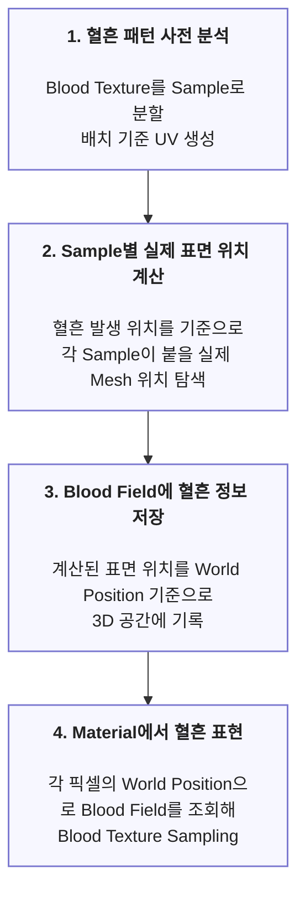
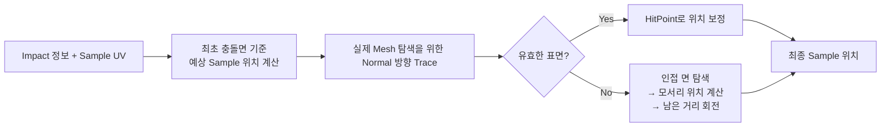
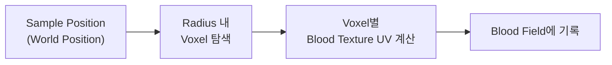

# World-Space 3D Blood Field

> World Space에 혈흔 Texture 정보를 저장하고 Material에서 조회해 모서리, 굴곡, Foliage 등 기존 Decal 방식의 한계를 보완한 혈흔 시스템


---

## 목차

- [설계 배경](#설계-배경)
- [구조 다이어그램](#구조-다이어그램)
- [핵심 구현](#핵심-구현)
  - [1. Blood Pattern Sample 생성](#1-blood-pattern-sample-생성)
    - [Grid 기반 Sample 추출](#grid-기반-sample-추출)
    - [Alpha Coverage 기반 유효 Cell 선택](#alpha-coverage-기반-유효-cell-선택)
    - [Editor 사전 처리 및 Data Asset 저장](#editor-사전-처리-및-data-asset-저장)
  - [2. Sample별 실제 표면 위치 계산](#2-sample별-실제-표면-위치-계산)
    - [1차 Trace - 완만한 표면 보정](#1차-trace---완만한-표면-보정)
    - [2차 Trace - 급격한 표면 변화 탐색](#2차-trace---급격한-표면-변화-탐색)
  - [3. 3D Blood Field 기록](#3-3d-blood-field3d-volume-texture-기록)
    - [Compute Shader 2-Pass로 Blood Field 갱신](#compute-shader-2-pass로-blood-field-갱신)
    - [Sample 주변 Voxel 갱신](#sample-주변-voxel-갱신)
    - [혈흔 색이 아닌 재구성 정보 저장](#혈흔-색이-아닌-재구성-정보-저장)
  - [4. Material에서 Blood Field 조회](#4-material에서-blood-field-조회)
- [트레이드오프 및 한계](#트레이드오프-및-한계)
- [관련 코드](#관련-코드)

---

## 설계 배경

Decal은 하나의 투영 방향을 기준으로 **영역 내에 이미지를 투영**하기 때문에 **표면 방향이 크게 달라지는 모서리, 굴곡 등**에서는 원본 형태를 유지하기 어려웠습니다. 따라서 다양한 표면에서도 일관된 혈흔 표현이 가능한 시스템을 만들려고 했습니다.

|  |  |  |
|:---:|:---:|:---:|
| **모서리에서 길게 늘어지는 현상** | **Foliage에서 거의 보이지 않는 현상** | **굴곡에서 끊기는 현상** |

---

## 구조 다이어그램



---

## 핵심 구현

## 1. Blood Pattern Sample 생성

### 방법 소개

a. Blood Texture를 고정 Grid로 나누고 각 Cell 내부에서 혈흔 Alpha가 차지하는 Coverage를 계산합니다.

b. 일정 비율 이상 혈흔이 포함된 Cell만 선택해 해당 Cell의 중심 UV를 Sample 배열로 저장합니다. 생성된 Sample은 런타임에서 실제 표면 위치를 계산하기 위한 기준점으로 사용합니다.


---

### 표면 변화 대응을 위한 Sample 단위 분할

Decal은 하나의 투영 방향을 기준으로 이미지를 투영하기 때문에, 표면 방향이 급격하게 달라지는 모서리나 굴곡에서 원래 혈흔 패턴 형태를 유지하기 어렵다고 판단했습니다.

따라서 Normal이 크게 달라지는 영역을 독립적으로 처리하기 위해 Blood Texture를 여러 Sample로 나누고, 각 Sample이 배치될 실제 표면 위치를 개별적으로 계산하도록 했습니다.

---

### Grid 기반 Sample 추출

Sample은 최종 혈흔 이미지를 복원하는 데이터가 아닌, 혈흔이 존재할 영역의 대표 위치입니다. 실제 형태와 디테일은 최종 단계에서 원본 Blood Texture를 다시 Sampling하여 표현합니다.

#### 검토한 대안 - Weighted Random Sampling

혈흔 픽셀의 분포를 정밀하게 반영하기 위해 WRS도 검토했습니다. 하지만 Sample의 목적은 대표 위치를 얻는 것이므로 후보 추출 및 거리 검증까지 추가하는 것은 현재 목적에 비해 복잡하다고 판단했습니다.

#### 최종 선택 - 고정 Grid

Sample로 분할하기 위해 Texture를 동일한 크기의 Cell로 나누고 각 Cell에서 최대 하나의 Sample만 생성하는 방법을 선택했습니다.

- Sample 수의 상한 명확함 - 5x5 Grid 기준 최대 25개
- 추가 후보 탐색 불필요 - 각 Cell 한 번씩만 검사
- 특정 영역으로 Sample이 몰리는 현상 방지 - 서로 떨어진 영역도 독립 판단

---

### Alpha Coverage 기반 유효 Cell 선택

Blood Texture는 불규칙한 형태를 가지므로 전체 영역이 혈흔으로 채워질 가능성이 낮고 Alpha가 비어 있는 영역이 많이 포함됩니다. 따라서 Grid의 모든 Cell에서 Sample을 생성하면 혈흔이 전혀 없거나 아주 적은 픽셀만 포함된 영역까지 동일하게 하나의 Sample을 차지하게 될 수 있었습니다.

각 Sample은 이후 표면 탐색과 Blood Field 기록으로 이어지기 때문에 작은 Cell까지 유지할 필요가 없다고 판단했습니다.

#### 방법

각 Cell에서 유효한 Alpha 픽셀이 차지하는 비율을 계산하고 일정 Coverage 이상인 Cell만 최종적으로 Sample로 선택했습니다.

#### 실험 결과

여러 Coverage를 비교한 결과, 1%는 너무 작은 영역까지 유지되었고 5%는 너무 많은 영역이 탈락되었습니다. 따라서 3%를 기준값으로 선택했습니다.

| **1%** | **3%** | **5%** |
|:---:|:---:|:---:|
|  |  | |
|  |  | |

---

### Editor 사전 처리 및 Data Asset 저장

Texture 분석 결과는 Texture가 변경되지 않는 한 같기 때문에, Editor에서 한 번 생성하고 Runtime에서는 읽어 사용할 수 있도록 구성했습니다.

#### 방법

a. Blood Pattern용 Data Asset을 생성하고 Blood Texture를 지정합니다.

b. Editor Tool에서 Texture를 분석하고 Sample UV를 자동 생성하여 해당 Data Asset에 저장합니다.

c. 사용할 Blood Pattern Data Asset을 Project Settings의 배열에 넣어줍니다.

d. 등록된 Data Asset의 Blood Texture 정보를 가져와 Material에서 참고할 Texture2DArray를 자동 생성 및 갱신하도록 했습니다.
이를 통해 Texture ID와 Texture Array 인덱스를 수동으로 관리하며 발생할 수 있는 불일치 문제를 줄였습니다.


---

## 2. Sample별 실제 표면 위치 계산

### 방법 소개

Blood Texture에서 생성된 Sample은 최초 충돌 지점의 접평면을 기준으로 예상 위치가 계산됩니다. 하지만 실제 Mesh는 평면이 아닐 수 있기 때문에 예상 위치를 그대로 사용하면 굴곡, 모서리에서 Sample이 실제 표면에서 떨어질 수 있습니다.




---

### 충돌면 기준 예상 Sample 위치 계산

혈흔 중심 위치인 `Impact Point`를 기준으로 `Impact Normal`과 혈흔이 퍼지는 방향 `Direction`을 이용해 충돌면 위의 `Tangent`, `Bitangent`축을 구성했습니다.

이후 각 `Sample UV`가 혈흔 중심에서 얼마나 좌우상하로 떨어져 있는지 계산하고 그 거리를 충돌면의 `Tangent`, `Bitangent` 방향으로 적용해 Sample이 실제 놓일 위치를 계산했습니다.


이 위치는 최종 위치가 아닌 이후 Trace를 통해 실제 Mesh 표면 위치를 찾기 위한  기준점으로 사용합니다.

---

### 1차 Trace - 완만한 표면 보정

예상 Sample 위치(최초 충돌면이 평평하게 이어진다고 가정한 위치)에서 기존 Normal 방향으로 Trace하여 실제 표면을 탐색했습니다.


처음에는 단순 Hit 여부만으로 1차 Trace가 성공하였다고 판단하였지만, 긴 Trace가 먼 위치에 있는 엉뚱한 표면을 Hit할 수도 있었습니다. 그래서 예상 위치와 Hit Point의 거리, 기존 Normal과 Hit Normal의 차이를 함께 검사했습니다.

> Collision Hit과 현재 알고리즘에서 사용할 수 있는 유효한 Hit을 구분했습니다.

``` cpp
if (DoTrace(NormalHit, OriginalLoc + Basis.Normal * 50.f, -Basis.Normal, 100.f))
{
	const float CorrectDistance = (NormalHit.ImpactPoint - OriginalLoc).Size();
	const float NormalDot = FVector::DotProduct(NormalHit.ImpactNormal.GetSafeNormal(), Basis.Normal);

	if (CorrectDistance <= 5.f && NormalDot >= SmoothNormalThreshold)
	{
		Location = NormalHit.ImpactPoint;
		bValidNormalHit = true;
	}
}

if(!bValidNormalHit)
{
	// 2nd Trace
}
```

---

### 2차 Trace - 급격한 표면 변화 탐색

1차 Trace에서 유효한 표면을 찾지 못하면 Sample이 모서리를 넘어가 급격한 Normal 변화가 있는 인접면에 존재해야 할 가능성이 있다고 판단했습니다.

실패한 경우 표면 안쪽으로 시작점을 보정하여 Center에서 예상 Sample 위치까지의 이동 방향을 기준으로 양방향 Trace를 추가 진행했습니다.


#### 모서리 추론 및 Wrapping

2차 Trace의 충돌 지점은 탐색을 위한 위치이므로 그대로 최종 Sample 위치로 사용할 경우 패턴 간격이 무너질 수 있었습니다. 따라서 2차 Trace 결과로 새 표면을 정의하고 기존 Sample 이동선과의 교점으로 실제 방향이 꺾이는 모서리를 계산했습니다.

모서리까지 이미 이동한 거리를 제외한 남은 이동거리를 새 Normal 기준으로 회전시켜 적용하여 모서리를 넘어가더라도 원래 Sample 간의 거리와 간격을 최대한 유지했습니다.


``` cpp
float UsedDistance = FVector::DotProduct((ImpactPoint - Center), NewNormal) / FVector::DotProduct(MoveDir, NewNormal);
float TotalDistance = Offset.Size();
if (UsedDistance < 0.f || UsedDistance > TotalDistance) return false;

FVector CornerPoint = Center + MoveDir * UsedDistance;

FQuat DeltaRotation = FQuat::FindBetweenNormals(OldNormal, NewNormal);
FVector RotatedMoveDir = DeltaRotation.RotateVector(MoveDir);

OutLocation = CornerPoint + RotatedMoveDir * (TotalDistance - UsedDistance);
```

자세한 실패 과정과 Probe 위치, HitPoint 사용 문제, Chamfer 대응 과정은 Troubleshooting - Blood Field 모서리 구간 Sample 위치 보정에 정리했습니다.

---

## 3. 3D Blood Field(3D Volume Texture) 기록

### 방법 소개

앞 단계에서 계산한 각 Sample의 실제 표면 위치를 Material이 렌더링 시 다시 찾을 수 있도록 **World Position 기준의 3D Blood Field** 에 기록했습니다.

각 Sample은 하나의 점으로만 저장하지 않고 Sample의 Radius 범위 안 Voxel을 갱신하며, Voxel마다 원본 Blood Texture에서 대응되는 UV를 계산해 저장합니다.



---

### World Position 기반 3D Volume Texture

혈흔이 최종적으로 표현되기 위해서는 여러 Material이 본인 위치에 혈흔이 존재하는지 확인할 수 있어야 했습니다.

Material은 각 픽셀의 World Position을 이미 알고 있기 때문에, 이를 Blood Field의 3D 좌표로 변환하면 혈흔 목록을 별도로 탐색하지 않고 현재 공간에 기록된 정보를 직접 조회할 수 있습니다.

따라서 **World Position과 혈흔 데이터를 공간적으로 대응**시키기 위해 3D Volume Texture를 Blood Field로 사용했습니다.

---

### Compute Shader 2-Pass로 Blood Field 갱신

여러 혈흔의 Sample이 동일한 Voxel에 영향을 주면 각 Thread가 최종 UV를 동시에 기록하는 Race Condition이 발생할 수 있기 때문에 어느 혈흔의 정보를 남길지 결정해야 했습니다.

#### Pass 1 — Winner Selection

`Intensity`(Sample 중심과의 거리) + `SplatID`를 하나의 uint로 Packing하고 InterlockedMax를 사용해 각 Voxel에서 가장 강한 Splat을 선택해 Resolve Texture에 저장합니다.

Splat: 실제 표면 위치가 계산되어 월드 공간에 배치된 하나의 Sample

동일 Voxel에 대한 동시 Write 충돌을 방지하기 위해 InterlockedMax를 사용하고 어떤 혈흔을 남길지 비교 기준인 Intensity와 식별용 SplatID를 하나의 uint로 Packing하여 Atomic 연산 한 번으로 남길 혈흔 선정과 ID 저장을 함께 처리했습니다.

``` cpp
uint QuantizedIntensity = (uint)(saturate(Intensity) * 65535.0);
if (QuantizedIntensity == 0)
    return;

uint Packed = (QuantizedIntensity << 16) | SplatID;
InterlockedMax(ResolveTextureUAV[TargetVoxel], Packed);
```

#### Pass 2 — UV Resolve

Pass 1의 결과 Resolve Texture의 Splat ID로 위치 / 방향 / SampleUV / Pattern 정보를 다시 가져온 뒤, 해당 Voxel의 상대 위치를 계산해 최종 UV + Pattern ID를 Blood Field에 기록합니다.

``` cpp
Splat Data
    ↓
Pass 1 : Voxel별 Winner Splat 선택
    ↓
Resolve Texture
    ↓
Pass 2 : 최종 Splat 기준 최종 UV 계산
    ↓
Blood Field
    ↓
Material Sampling
```

``` cpp
uint SplatID = Packed & 0xFFFF;
FSplatGPUData Splat = SplatBuffer[SplatID];

float3 Offset = WorldPosition - Splat.Location;
float UOffset = dot(Offset, Splat.Tangent) / PatternWorldSize.x;
float VOffset = dot(Offset, Splat.Bitangent) / PatternWorldSize.y;
float2 FinalUV = float2(Splat.SampleUV.x + UOffset, Splat.SampleUV.y + VOffset);

// R = FinalUV.X, G = FinalUV.Y, B = PatternID, A = Valid/Mask
OutVolume[DispatchThreadID] = float4(FinalUV, PatternID, 1.0f);
```

---

### Sample 주변 Voxel 갱신

Sample은 최종 혈흔을 찍는 하나의 픽셀이 아니라, 원본 Blood Texture의 특정 영역을 World-Space에 배치하기 위한 기준 위치입니다. 따라서 Sample이 위치한 Voxel 하나만 갱신하면 혈흔이 점처럼 기록되고 원본 Texture의 형태를 표현할 수 없습니다.

이를 위해 Sample의 Radius 범위 안에 있는 Voxel을 함께 갱신하고, 각 Voxel이 Sample 중심에서 얼마나 떨어져 있는지를 이용해 원본 Blood Texture의 대응 UV를 계산했습니다. 이렇게 Sample은 혈흔 영역의 중심 기준점 역할만 하고, 실제 패턴의 모양은 원본 Blood Texture에서 다시 가져올 수 있도록 했습니다.

---

### 혈흔 색이 아닌 재구성 정보 저장

Blood Field를 Texture보단 원본 Blood Texture를 재구성하기 위한 공간 데이터로 설정했습니다. Material이 원본 Blood Texture를 다시 Sampling하는 데 필요한 정보만 저장했습니다.

Sample 수나 Field 해상도가 혈흔의 세부 Texture 표현을 직접 결정하지 않고 최종 디테일은 원본 Blood Texture가 담당하도록 역할을 분리했습니다.

#### 기존 방식의 한계

기존 Blood Field는 각 Voxel에 혈흔 존재 여부와 강도만 저장했습니다. 따라서 해당 위치에 혈흔이 있다는 것은 알 수 있었지만, 원본 Blood Texture의 어느 위치를 Sampling해야 하는지는 알 수 없었습니다.

#### 검토한 대안 - Material에서 UV 역산 검토

Material에서 Pattern UV를 다시 계산하려면 각 Sample의 Location, Tangent, Bitangent 등 생성 당시의 정보를 계속 유지해야 했습니다. 혈흔이 누적될수록 보관해야 할 Sample 데이터가 증가하고, Material에서도 현재 픽셀에 대응하는 Sample을 탐색해야 하기 때문에 메모리와 조회 비용이 커집니다.

#### 최종 선택

혈흔을 Field에 기록하는 시점에는 이미 Sample 위치, 방향, Pattern 크기, Sample UV 등 필요한 정보를 가지고 있습니다. 따라서 이 시점에서 최종 UV를 계산하고, Material은 Blood Field에 저장된 결과만 읽도록 역할을 분리했습니다.

| Channel | 저장 정보 |
|:---:|---|
| **R** | Blood Texture `UV.X` |
| **G** | Blood Texture `UV.Y` |
| **B** | `Texture ID` |
| **A** | `Valid Mask` |

----

## 4. Material에서 Blood Field 조회

표면 형태에 맞춰 혈흔 위치를 개별적으로 계산한 뒤 그 결과를 실제로 화면에 나타낼 방법이 필요했습니다. 각 Material의 World Position을 Blood Field의 UVW로 변환해 UV, Pattern ID, Mask를 조회하고, 해당 정보로 Texture2DArray를 Sampling해 최종 혈흔을 표현하도록 구성했습니다.

혈흔 표현이 필요한 Material에는 동일한 Material Function을 적용해야 합니다.


## 트레이드오프 및 한계

#### 3D Blood Field 해상도

해상도를 높이면 표면 표현 정밀도는 좋아지지만 메모리와 갱신 비용 증가

#### Material Function 적용 필요

Blood Field를 조회하려면 혈흔 표현 대상 Material마다 공통 MF를 적용해야 함

## 관련 코드
- [BloodFieldSubsystem](Plugins/BloodField/Source/BloodField/Private/BloodFieldSubSystem.cpp) [혈흔 요청 변환 및 Sample UV 계산]
- [BloodPatternEditorLibrary](Plugins/BloodField/Source/BloodFieldEditor/Private/BloodPatternEditorLibrary.cpp) [Data Asset 분석 및 에디터]
- [BloodField.usf](Plugins/BloodField/Shaders/Private/BloodField.usf)
- [BloodFieldSettings.cpp](Plugins/BloodField/Source/BloodField/Private/BloodFieldSettings.cpp) [사용할 Blood Texture로 `Texture2DArray` 자동 생성 및 갱신]
